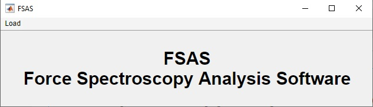
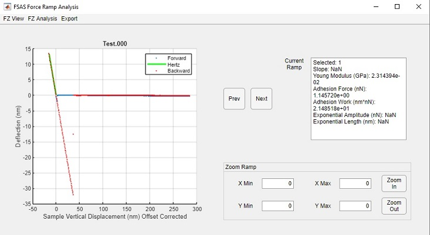
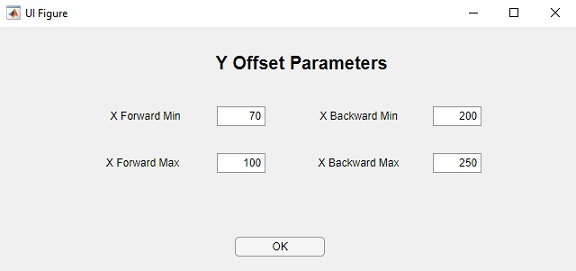
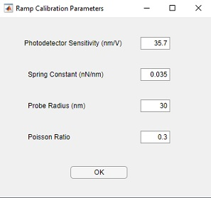
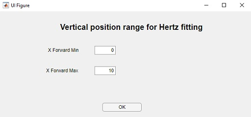
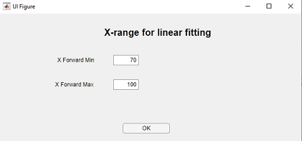
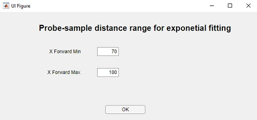
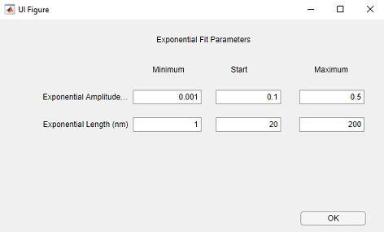
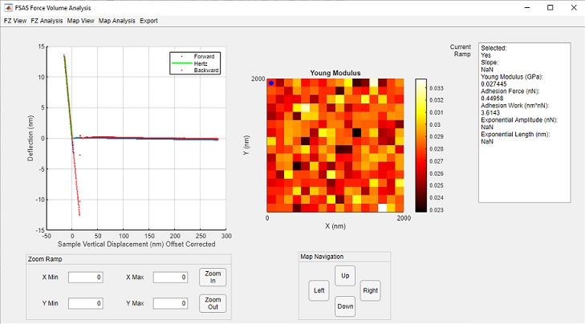

# FSAS 0.1 Quick reference manual
Last updated: 10th October 2019
## 1. Quick start
1. Clone/Download the repository
2. Open Matlab
3. Go to the FSAS folder
2. From the Matlab command prompt run:
```
>>FSAS;
```
This will open the FSAS main app

## 2. FSAS main app
### 2.1. Graphical Interface
When the command FSAS is run in the MatLab command prompt, the graphical interface shown below 
(Fig. 1) appears



_Figure 1. Main app of the FSAS software._
### 2.2. Load Menu
The load menu of the FSAS main app allows loading both files previously saved with the FSAS software 
and Nanoscope (force ramp and force volume) files.
#### 2.1.1 Load -> FSAS
Load files previously saved with the FSAS software (both force ramps and force volume files).
#### 2.1.2 Load -> Nanoscope
Load force ramps and force volume files obtained with the Bruker Nanoscope software.

Different apps will open depending on whether force ramps (section 3) or a force volume file (section 4) are loaded.

## 3. Force Ramp Analysis App
### 3.1. Graphical Interface
The graphical interface for the Force Ramp Analysis App (Fig. 2) appears when a one or several force ramps are loaded 
in the FSAS main app (wither in a FSAS format or in a Nanoscope format).



_Figure 2. Force Ramp Analysis App._

The graphical interface contains one axes for plotting force ramps. 

The name of the file corresponding to the ramp is shown on top of the axes. 

To the right of the axes two push buttons are found (labelled Prev, for Previous, and Next) 
to navigate along all the loaded force ramps.

To the right of these buttons there is a text area where information on the visualized force ramp is shown.
Specifically, the information provided is:

 - **Selected:** this property indicates whether the visualized sample is selected (value 1) or not (value 0). 
 This is an important concept in FSAS, as any type of analysis will only applied on selected force ramps. 
 By default, all force ramps are selected when loaded.
 - **Slope:** this is the slope resulting from linear fits of selected regions of the force ramp. If a linear fit
 has not been performed on the ramp, the default NaN (Not a Number) is shown.
 - **Young Modulus:** Young Modulus obtained by fitting the contact region of the ramp with the Hertz contact model.
 If this analysis has not been performend, a default NaN is shown.
 - **Adhesion Force:** Maximum adhesion force of the backward force ramp. This requires that the ramp photodetector
 values have been previously transformed into forces. If not, a default NaN appears.
 - **Adhesion Work:** Adhesion Work. This requires that i) the photodetector values of the visualized force
 ramp were transformed into forces and ii) that the sample vertical positions were transformed into probe-sample
 distances. Otherwise, NaN is shown.
 - **Exponential Amplitude:** FSAS allows fitting regions of the force ramps with exponential functions. However, 
 only if the were previously processed so that a force vs probe-sample distance representation is available. In this case,
 and if an exponential fit has been done, this field shows the amplitude of the exponential function resultingfrom the fit.
 - **Exponential Length:** In a similar way, this field shows the characteristic length of the exponential fit.


Below the text area there are edit boxes for setting limits for the visualization of the force ramp plots 
in both horizontal and vertical dimensions.

### 3.2. Menu
#### 3.2.1. FZ View
**Scan Direction.** Allows choosing the direction of the visualized Force Ramp. This can vary between:
 - forward: sample approaching the probe.
 - backward: sample withdrawing from the probe.
 - both forward and backward.

**X Representation.** Allows changing the representation of the force ramp horizontal axis. Options:
 - Raw: original representation of sample vertical positions with the zero value being that closer to the sample.
 - Offset Corrected: The contact point within the sample vertical positions has been found (By fitting the contact
 region with the Hertz model) and used as an offset.
 - Probe-sample Distance.
 
**Y Representation.** Allows changing the representation of the force ramp vertical axis. Options:
 - Raw: original representation of photodetector vertical values.
 - Offset Corrected: The region of zero force has been determined, and the average vertical values of this region
 have been substracted from the vertical photodetector values of the raw force ramp.
 - Deflection: Deflection of the cantilever.
 - Force: force between probe and sample.
 
**External Figure.** Allows changing the representation of the force ramp vertical axis. Options:
 
#### 3.2.2. FZ Analysis
**Selection.** Allows selection or unselecting force ramps one by one or all at a time.

**Y Offset -> Average.** Substracts an offset from both the forward and backward raw force ramps. It opens an external
app (Fig. 3) where the range of sample vertical positions of the ramp (both in the forward and backward directions)
that will be used to calculate the average value of photodetector vertical signals that will be used as an offset. Once that
the minimum and maximum values of the range have been entered click the OK push button.



_Figure 3. App for defining the range of sample vertical values._

**Ramp Calibration.** Calibrates the force ramp vertical values so that deflection and force values can be represented. It
opens an external app (Fig. 4) that allows entering:
 - photodetector sensitivity: used to find cantilever deflection values.
 - (cantilever) spring constant: used to find probe sample interaction forces.
 - Probe radius and Poisson ratio: these parameters are of used for fitting the contact region of the ramp to the Hertz model 
 in a later stage, as they are needed for Young modulus calculations.



_Figure 4. App for defining parameters for force ramp calibration._

**X Offset -> Hertz.** Fits a user-defined contact region with the Hertz model. As a result i) the Young modulus for each selected
force ramp is found as well as ii) the contact point, which allows calculating the offset corrected sample vertical position horizontal
representation of the force ramps.



_Figure 5. App for defining horizontal range for Hertz fitting._

It also finds automatically the probe-sample distance horizontal representation.

**Linear Fit.** Fits a user-defined region of the ramp with a linear function. As above, it calls an external app (Fig. 6) where this region
is defined by the user.



_Figure 6. App for defining range for linear fitting._

**Exponential Fit.** Fits a user-defined region of the ramp with a linear function. As above, it calls an external app (Fig. 7) where this region
is defined by the user. 



_Figure 7. App for defining range for exponential fitting._

In this case, a second external app (Fig. 8) appears where the user shoul provide minimum, initial and maximum estimates for both the
amplitude and the characteristic length of the exponential fit.



_Figure 8. App for defining minimum, initial and maximum estimates for both the
amplitude and the characteristic length of the exponential fit._

#### 3.2.3. Export
Saves analyzed data as MatLab Structures.

 - **Ramp.** Structure with information for only the currently visualized ramp.
 
 - **FSAS.** Structure with information for all the loaded ramps. This file can be opened again with FSAS for continue with 
 the analysis at a later stage.


## 4. Force Volume Analysis App
### 4.1. Graphical Interface
The graphical interface for the Force Volume Analysis App is shown in Fig. 9 below. 



_Figure 9. Force Volume Analysis App._

The graphical interface contains two axes.

The one on the left is used for plotting force ramps.

The one in the right is used for plotting maps. By maps we refer to either the topography (height)
of the sample, or a characteristic quantity calculated for each pixel/point of the scanned area. 
Typically, this will be a quantity obtained from a given analysis of the force ramp corresponding to
the specific pixel e.g., Young modulus, etc.

Below the Force Ramp Axes there are edit boxes for setting limits of the force ramp plots in both
horizontal and vertical dimensions.

Below the Map Axes there are buttons for navigating along the map. As one navigates along the map, 
the ramp shown in the Ramp Axes changes so that it always represents that obtained in the pixel/point
highlighted (with a blue dot) in the Map.

At the right of the map, a text area is shown with different quantities associted with the current
visualized point/ramp.
### 4.2. Menu
#### 4.2.1. FZ View
This menu section allows calling methods related to the way force ramps are visualized in the FSAS software.
These methods are the same as those available in the Force Ramp Analysis App, so refer to that section (3.2.1)
for details. 

#### 4.2.2. FZ Analysis
This menu section contains methods for the analysis of force ramps. These methods are the same as those contained in
the analogous section in the FOrce Ramp Analysis Ramp (except for "Selection" method, whcin in this App in contained in the
Map Analysis menu section, see below). Thus, for details refer to section 3.2.2 of this manual.

#### 4.2.3. Map View
This menu section allows choosing between different quantities to be imagedin the Map Axes.

#### 4.2.4. Map Analysis
**Selection.** Allows selecting or unselecting force ramps of the force volume file one by one or all at a time.

**Histogram.** Plots, in external figures, histograms on the quantity visualized in the Map Axes.


#### 4.2.5. Export
Allows selection or unselecting force ramps one by one or all at a time.

**MatLab Structure -> Ramp.** Structure with information for only the currently visualized ramp.

**MatLab Structure -> Map.** Structure with information for only the currently visualized map.

**MatLab Structure -> FSAS.** Structure with information for the whole force vume file and its 
analysis up to that point. This file can be opened again with FSAS for continue with 
the analysis at a later stage.